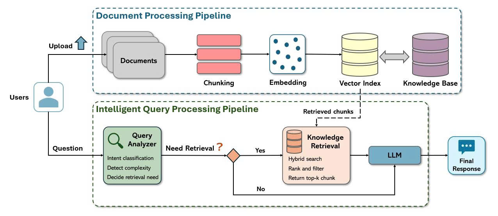

# DocBrain

RAG system for document Q&A. Ingests `PDF` / `DOCX` / `TXT` into isolated sessions, answers strictly from the uploaded content, runs fully offline on CPU (no external inference API).



## Features

- Source citations: file name, page number, relevance score on every grounded answer
- Local inference via `llama.cpp` + quantized Qwen2.5 GGUF - no API key, no per-token cost
- Hybrid retrieval: FAISS dense (`multilingual-e5-small`) + BM25 sparse, RRF fusion, cross-encoder rerank
- Table-aware PDF parsing: `pdfplumber` fallback so table rows/columns don't get scrambled
- Durable storage: sessions and indices mirrored to a Hugging Face Hub dataset (Spaces disk is ephemeral)
- Session isolation: no cross-session citation leakage

## Production Optimizations

| Problem | Fix |
|---|---|
| Min-max score always looked "confident" even on irrelevant matches | Sigmoid over raw cross-encoder logit gives an absolute relevance score |
| Table rows/columns scrambled on extraction | `pdfplumber.extract_tables()` fallback for tabular pages |
| Oversized chunks diluted embeddings | True recursive chunking with a hard size cap |
| One slow request blocked all others | CPU-bound work (embed/rerank/generate) moved to a thread pool |
| `llama.cpp` auto thread detection was unreliable in-container | `n_threads` / `n_batch` set explicitly |
| Query-translation LLM call doubled latency | Removed - the embedding model is already cross-lingual |
| Data lost on every Space restart | Synced to a Hugging Face Hub dataset repo |
| Unbounded uploads | Size limit + file-type allowlist |
| Anyone could delete any session | Optional `APP_API_KEY` header check on write/delete routes |

## Limitations

- Free CPU tier = slow generation; use a paid CPU/GPU tier for latency-sensitive use
- No per-user accounts, only a shared API key
- Reranker is not Vietnamese-tuned by default - validate before production use on Vietnamese content
- Single-process; scaling out needs stateless replicas behind a load balancer

## Setup

```bash
pip install -r requirements.txt
cp .env.example .env   # fill HF_TOKEN + HF_DATASET_REPO_ID for durable storage (optional)
python app.py
```

UI: `http://localhost:7860` · Docs: `http://localhost:7860/docs`

## Environment Variables

| Variable | Purpose |
|---|---|
| `HF_TOKEN` | Write-scope HF Hub token, storage only (not used for LLM) |
| `HF_DATASET_REPO_ID` | Target dataset repo, e.g. `user/docbrain-storage` |
| `APP_API_KEY` | Header secret for write/delete endpoints |
| `MAX_UPLOAD_SIZE_MB` | Upload size limit |
| `LOG_LEVEL` | `DEBUG` / `INFO` / `WARNING` / `ERROR` |

## Deploy to Hugging Face Spaces

1. New Space -> SDK: Docker
2. Push repo (`.env` is gitignored)
3. Settings -> Repository Secrets: `HF_TOKEN`, `HF_DATASET_REPO_ID`, `APP_API_KEY`

## Testing

```bash
pytest tests/
```

## License

MIT
